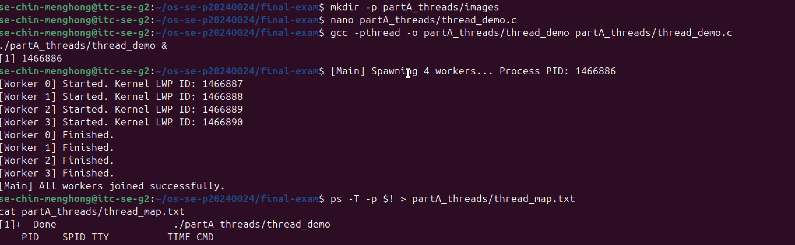
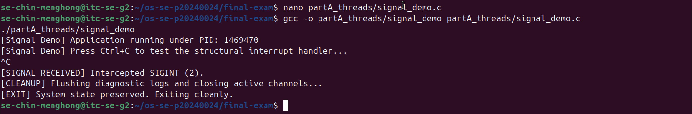
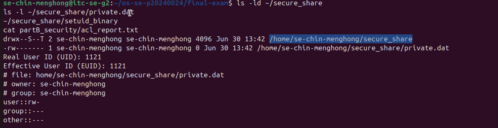
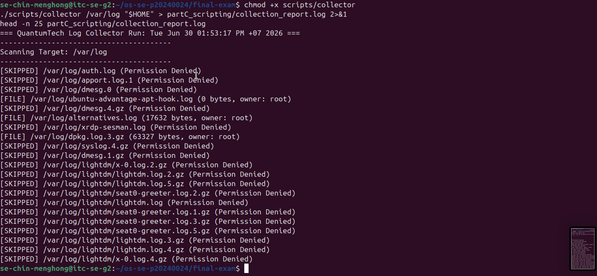
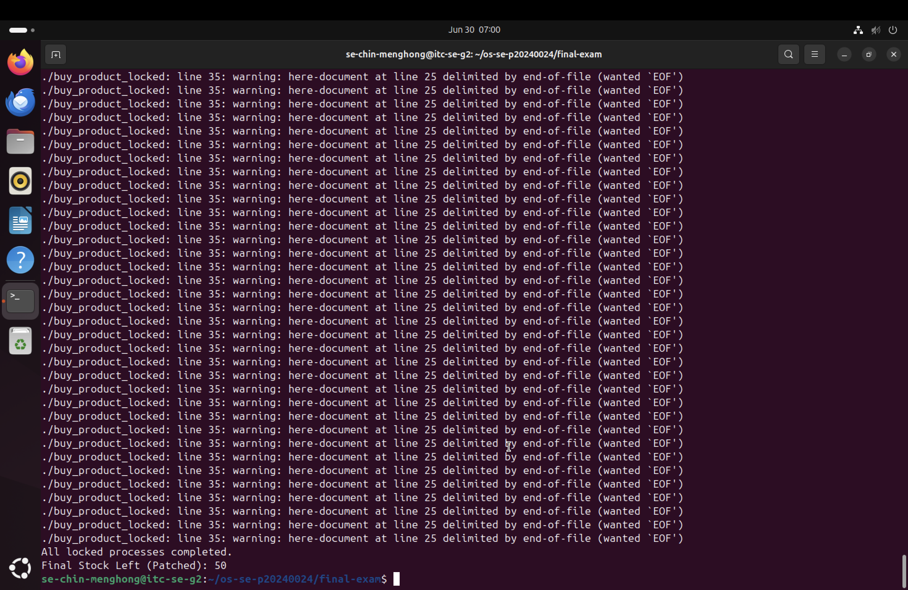
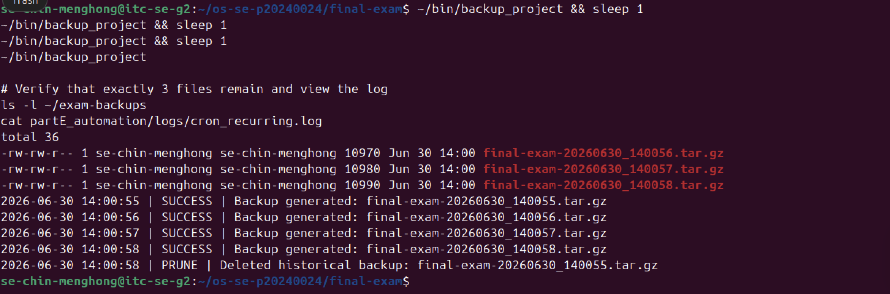

# Final Exam — Master Report

<!-- ===== COVER SHEET — Required Section. Please complete all lines ===== -->
- **Student Name:** Menghong Chin
- **Student ID:** p20240024
- **Server Username:** se-chin-menghong
- **Exam Scenario Value (COMPANY / PRODUCT):** QuantumTech / Cleatify
- **Date & Start Time:** 2026-06-30 13:21 PM
- **AI Assistant Used:** Gemini

---

## Part A — Threads, Kernel Mapping & Signals

### 📸 Runtime Verification Screenshots
* **A1: Worker Threads Execution**  
  
* **A2: SIGINT Signal Trapping & Graceful Exit**  
  

### ✍️ Written Short Answer
* **Why does a worker thread's joined result reach the main thread, but a forked child's value would not?**  
  Threads execute inside a single shared virtual memory address space, meaning data stored on the shared heap by a worker thread is directly readable by the main thread during `pthread_join()`. Conversely, a forked child process creates an independent copy of the process with fully isolated memory boundaries; therefore, any state changes stay local to the child and never reach the parent without explicit Inter-Process Communication (IPC).

---

## Part B — Files, Permissions & Special Bits

### 📸 Runtime Verification Screenshot
* **B1: Special Bits (SUID, SGID, Sticky) Auditing**  
  

### ✍️ Written Short Answer
* **Translate your private file's final octal mode into the 9-char symbolic string:**  
  `600` → `rw-------`

---

## Part C — Bash Scripting, PATH & Safe File Scanning

### 📸 Runtime Verification Screenshot
* **C1: Cleatify Log Scanning Task Execution Receipt**  
  

### ✍️ Written Short Answer
* **Why did `greeter` fail to run by name before you added your `bin` directory to PATH?**  
  The shell only searches specific system execution paths included in the `$PATH` environment variable array when a plain command name is invoked. Until the local `~/bin` directory was appended to that environment array, the shell had no reference mapping for where the raw name `greeter` resided.

---

## Part D — Concurrency, a Race Condition & File Locking

### 📸 Runtime Verification Screenshot
* **D2: Synchronized Transaction Balance Validation (Value: 50)**  
  

### ✍️ Written Short Answer
* **Why did the unpatched `swarm` sometimes leave more stock than the correct final value?**  
  Without an advisory file lock, multiple concurrent execution paths read the same stale stock value from disk before modifying it (a classic lost-update race condition). Their sequential writes overwrote each other's updates, which resulted in fewer total decrements being applied to the file than intended.

---

## Part E — Backups, Archiving & cron Automation

### 📸 Runtime Verification Screenshot
* **E1: Retention Pruning Verification (Exactly 3 Files Remaining)**  
  

### ✍️ Written Short Answer
* **Archiving vs compression — which one actually shrank the bytes, and why?**  
  Compression (`gzip`) actually shrank the bytes. Archiving (`tar`) merely bundles independent directory and file streams sequentially into a single container file without modifying file sizes. Compression algorithms analyze data patterns and eliminate structural redundancies to actively decrease the overall storage footprint.