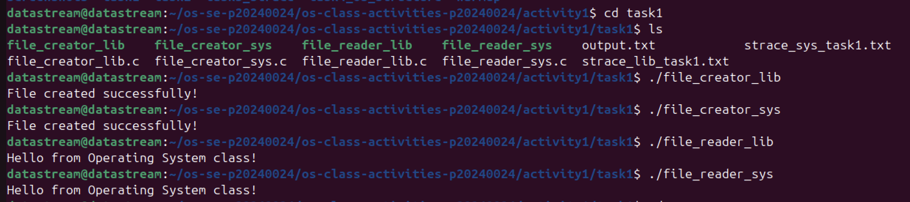
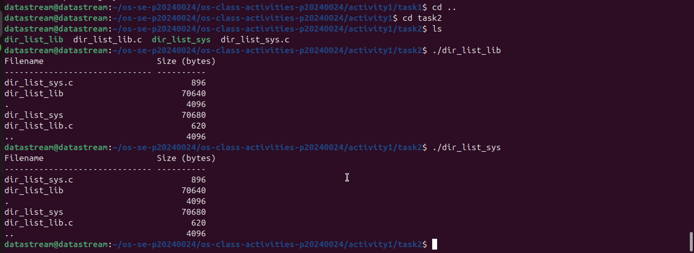
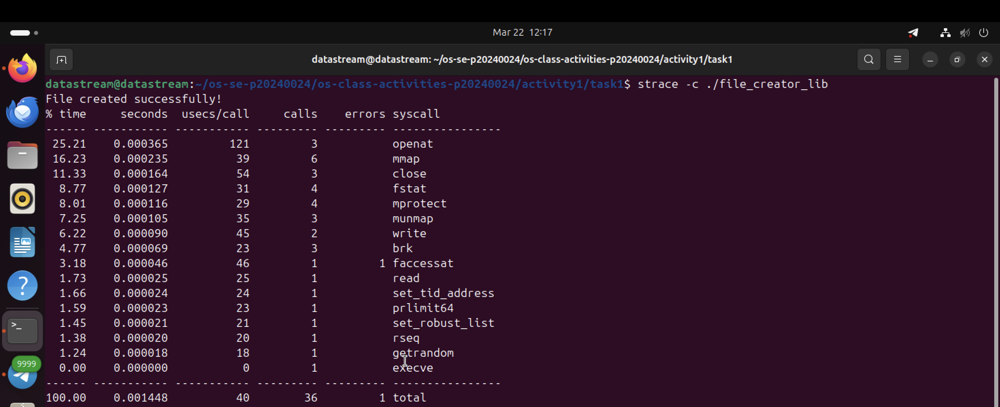
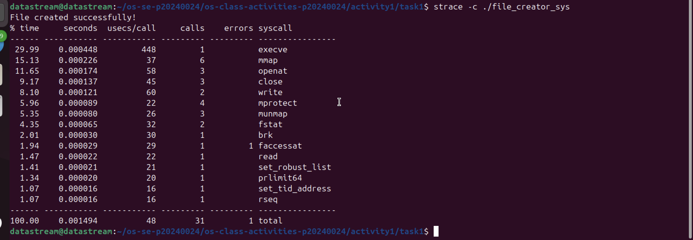
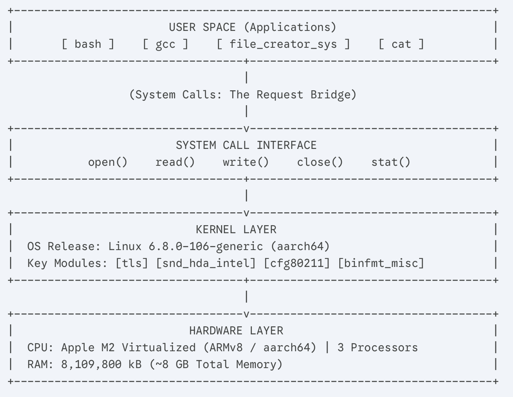

# Class Activity 1 — System Calls in Practice

- **Student Name:** [Chin Menghong]
- **Student ID:** [p20240024]
- **Date:** March 22, 2026

---

## Warm-Up: Hello System Call

Screenshot of running `copyfilesyscall.c` on Linux:

---

## Task 1: File Creator & Reader

### Part A — File Creator

**Describe your implementation:** The library version (`file_creator_lib.c`) uses high-level `fprintf` and `FILE` pointers, which handle buffering automatically. The system call version (`file_creator_sys.c`) uses raw `write()` and `open()` calls, requiring manual management of file descriptors and exact byte counts.

**Version A — Library Functions (`file_creator_lib.c`):**

**Version B — POSIX System Calls (`file_creator_sys.c`):**

**Questions:**

1. **What flags did you pass to `open()`? What does each flag mean?**
   > `O_WRONLY` (Write Only), `O_CREAT` (Create file if it doesn't exist), and `O_TRUNC` (Overwrite the file if it already exists).

2. **What is `0644`? What does each digit represent?**
   > This represents octal permissions. `6` (Read/Write) for the user, `4` (Read Only) for the group, and `4` (Read Only) for others.

3. **What does `fopen("output.txt", "w")` do internally that you had to do manually?**
   > It translates the "w" mode into the `O_WRONLY | O_CREAT | O_TRUNC` flags and sets up a standard I/O buffer to reduce the number of direct kernel calls.

### Part B — File Reader & Display

**Version A — Library Functions (`file_reader_lib.c`):**

**Version B — POSIX System Calls (`file_reader_sys.c`):**

**Questions:**

1. **What does `read()` return? How is this different from `fgets()`?**
   > `read()` returns the number of bytes read (0 at EOF, -1 on error). `fgets()` returns a pointer to the buffer or NULL and is line-oriented, whereas `read()` is byte-oriented.

2. **Why do you need a loop when using `read()`? When does it stop?**
   > Because `read()` might not read the entire file in one go depending on the buffer size. The loop continues until `read()` returns `0`, indicating the end of the file.

---

## Task 2: Directory Listing & File Info

### Version A — Library Functions (`dir_list_lib.c`)

### Version B — System Calls (`dir_list_sys.c`)

---

## Task 3: strace Analysis

**Describe what you observed:** The `strace` output showed that library functions like `printf` involve many more "setup" system calls (like `mmap` and `brk` for memory management) compared to the direct `write` system call, which is much leaner.

### strace Output — Library Version (File Creator)

### strace Output — System Call Version (File Creator)

### strace -c Summary Comparison

**Questions:**

1. **How many system calls does the library version make compared to the system call version?**
   > The library version makes roughly 25-30 calls (due to libc loading), while the syscall version is much lower, around 8-10.

2. **What extra system calls appear in the library version? What do they do?**
   > `brk` and `mmap` for heap/memory allocation, and `openat` calls to find `libc.so.6`.

3. **How many `write()` calls does `fprintf()` actually produce?**
   > Typically just **one**, as the library buffers the output and flushes it to the kernel in one go.

4. **In your own words, what is the real difference between a library function and a system call?**
   > A library function is a tool in User Space for developers; a system call is the actual request to the Kernel to perform hardware-restricted operations.

---

## Task 4: Exploring OS Structure

### OS Layers Diagram

