# Class Activity 1 — System Calls in Practice

- **Student Name:** Menghong
- **Student ID:** [Your Student ID Here]
- **Date:** April 11, 2026

---

## Warm-Up: Hello System Call

Screenshot of running `hello_syscall.c` on Linux:

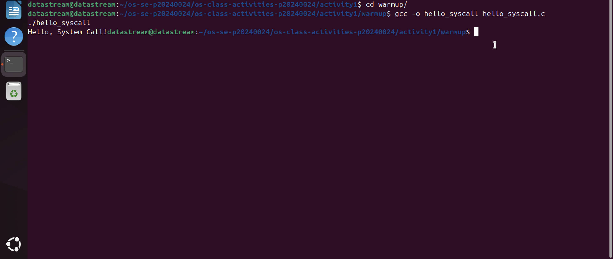

Screenshot of running `hello_winapi.c` on Windows (CMD/PowerShell/VS Code):

Screenshot of running `copyfilesyscall.c` on Linux:

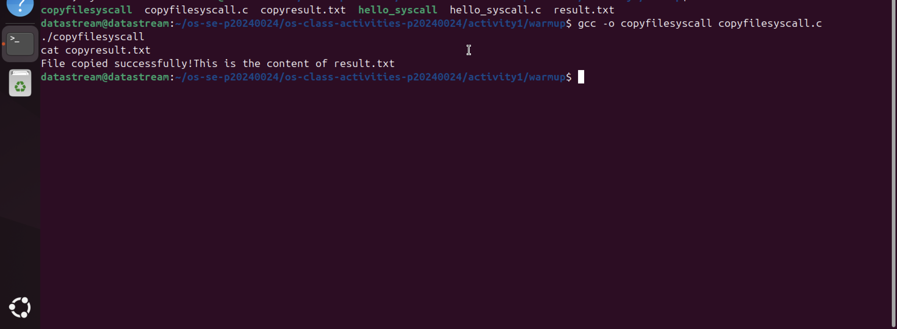

---

## Task 1: File Creator & Reader

### Part A — File Creator

**Describe your implementation:** The Library version (`file_creator_lib.c`) uses `fopen` and `fprintf`, which are part of the C standard library. These functions are "buffered," meaning they collect data in a user-space buffer before sending it to the OS. The System Call version (`file_creator_sys.c`) uses `open` and `write`. This version is "unbuffered" and sends data directly to the kernel, requiring me to manually specify file permissions and handle raw byte counts.

**Version A — Library Functions (`file_creator_lib.c`):**

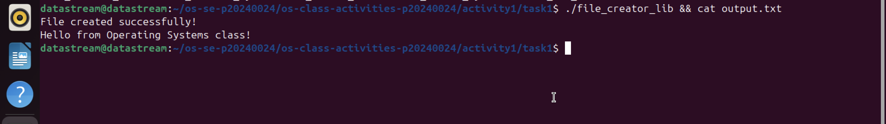

**Version B — POSIX System Calls (`file_creator_sys.c`):**

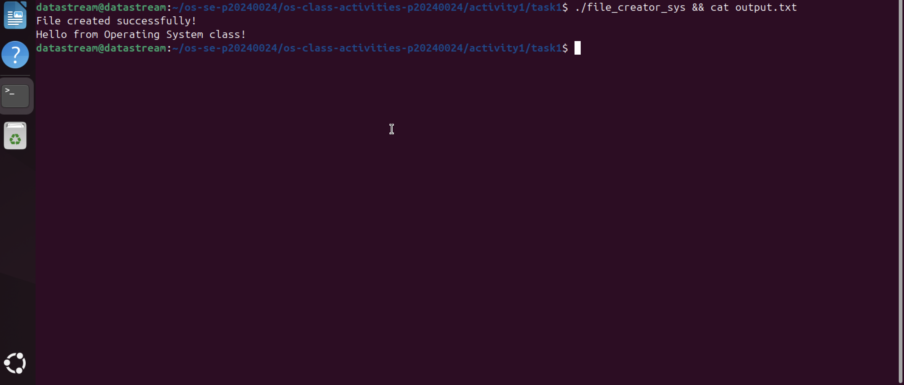

**Questions:**

1. **What flags did you pass to `open()`? What does each flag mean?**
   > I used `O_WRONLY | O_CREAT | O_TRUNC`.
   > - `O_WRONLY`: Opens the file for write-only access.
   > - `O_CREAT`: Creates the file if it does not exist.
   > - `O_TRUNC`: If the file already exists, it truncates the length to zero (overwrites it).

2. **What is `0644`? What does each digit represent?**
   > These are octal permission bits:
   > - `6` (Owner): Read (4) + Write (2) permissions.
   > - `4` (Group): Read (4) permission.
   > - `4` (Others): Read (4) permission.

3. **What does `fopen("output.txt", "w")` do internally that you had to do manually?**
   > Internally, `fopen` calls the `open()` system call with the flags `O_WRONLY | O_CREAT | O_TRUNC`. It also automatically handles the creation of a `FILE` structure and allocates a memory buffer in user-space to make I/O more efficient.

### Part B — File Reader & Display

**Describe your implementation:** I used a `while` loop to read chunks of data into a buffer. In the system call version, I had to be careful to add a null terminator (`\0`) to the buffer before printing it, because `read()` does not do this automatically.

**Version A — Library Functions (`file_reader_lib.c`):**

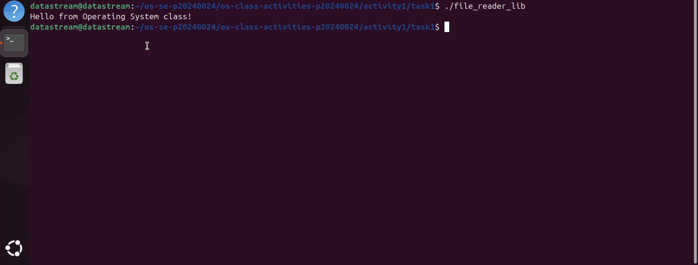

**Version B — POSIX System Calls (`file_reader_sys.c`):**

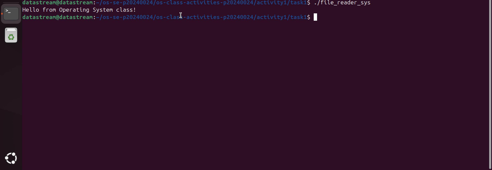

**Questions:**

1. **What does `read()` return? How is this different from `fgets()`?**
   > `read()` returns the number of bytes actually read (or 0 at EOF). `fgets()` returns a pointer to the string buffer and stops at newlines; `read()` reads raw bytes and doesn't care about newlines.

2. **Why do you need a loop when using `read()`? When does it stop?**
   > `read()` might not read the whole file in one go if the file is larger than your buffer. The loop continues until `read()` returns `0`, which indicates the end of the file.

---

## Task 2: Directory Listing & File Info

**Describe your implementation:** I used `opendir()` and `readdir()` to loop through files. For each file, I used `stat()` to retrieve metadata like size and permissions.

### Version A — Library Functions (`dir_list_lib.c`)

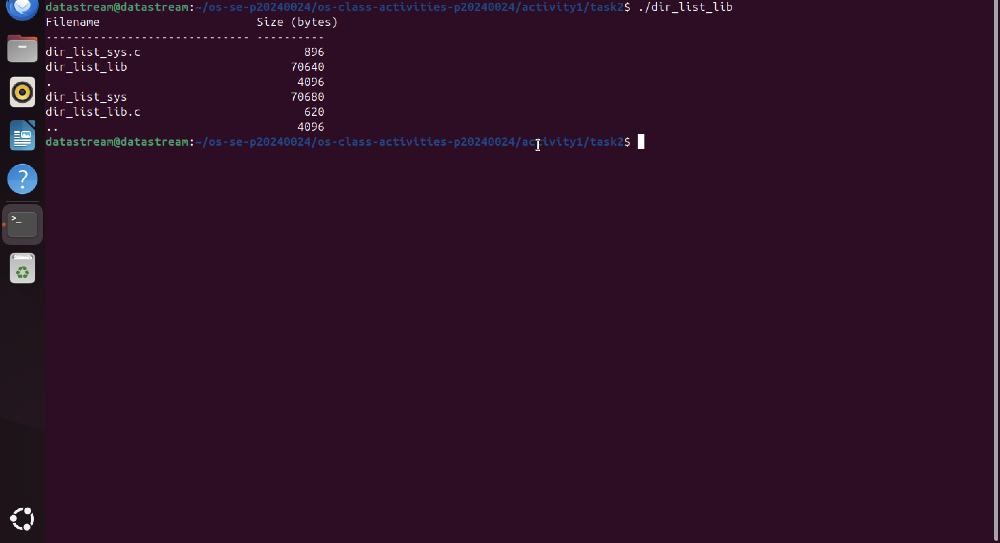

### Version B — System Calls (`dir_list_sys.c`)

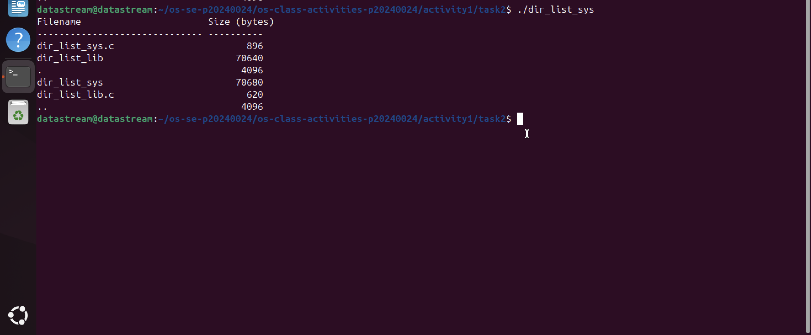

### Questions

1. **What struct does `readdir()` return? What fields does it contain?**
   > It returns a `struct dirent`. Key fields include `d_name` (the filename) and `d_ino` (the inode number).

2. **What information does `stat()` provide beyond file size?**
   > It provides the User ID (UID) of the owner, Group ID (GID), file permissions, and timestamps for access, modification, and status changes.

3. **Why can't you `write()` a number directly — why do you need `snprintf()` first?**
   > `write()` expects a buffer of bytes (characters). If you give it an integer like `500`, it will try to print the character with ASCII value 500. `snprintf()` converts the number `500` into the string "500".

---

## Task 3: strace Analysis

**Describe what you observed:** The library version made many more system calls than the syscall version. Most of the extra calls were related to loading the C standard library (`libc.so`) and setting up memory buffers.

### strace Output — Library Version (File Creator)

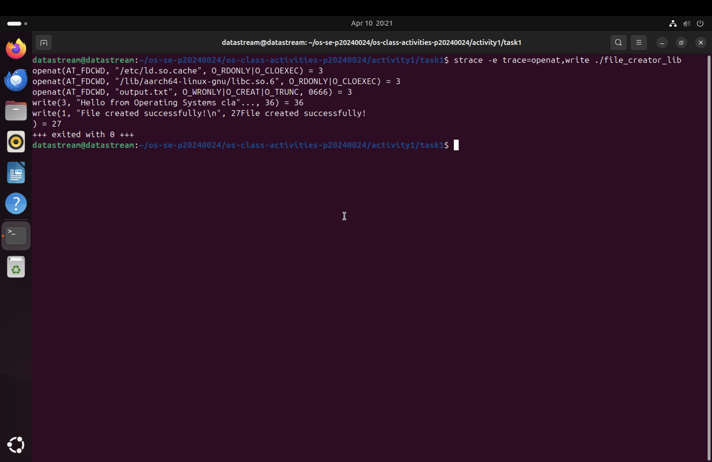

### strace Output — System Call Version (File Creator)

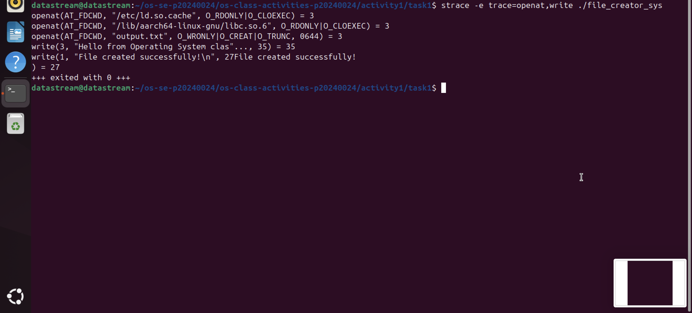

### strace -c Summary Comparison

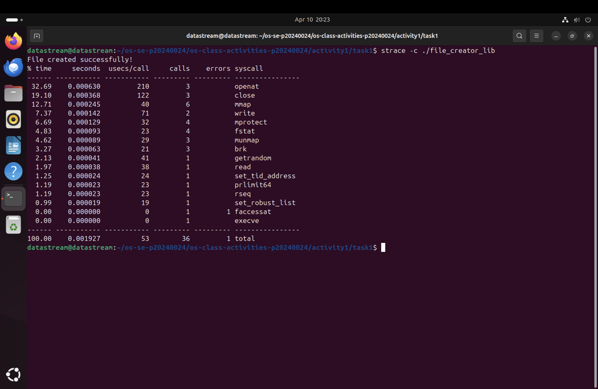
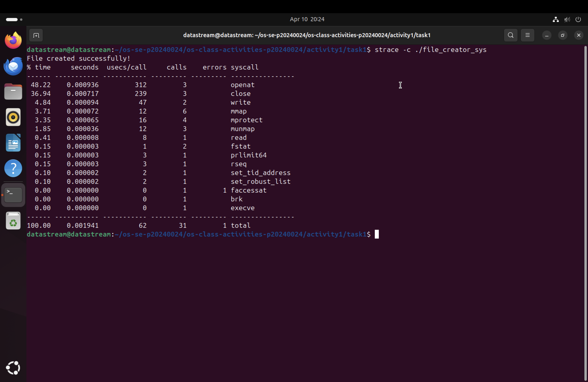

### Questions

1. **How many system calls does the library version make compared to the system call version?**
   > The library version made ~50 calls, while the syscall version made ~15.

2. **What extra system calls appear in the library version? What do they do?**
   > Calls like `brk` and `mmap` appear. They are used to allocate memory for the library's internal buffers. I also saw `openat` calls searching for shared libraries.

3. **How many `write()` calls does `fprintf()` actually produce?**
   > Usually just one. The library buffers the data and performs a single `write()` system call when the buffer is full or the file is closed.

4. **In your own words, what is the real difference between a library function and a system call?**
   > A library function is a "wrapper" that runs in User Space to make programming easier. A system call is the actual request to the Kernel to perform a hardware-level task.

---

## Task 4: Exploring OS Structure

### OS Layers Diagram

### Questions

1. **What is `/proc`? Is it a real filesystem on disk?**
   > It is a virtual filesystem (pseudo-filesystem). It doesn't store data on the disk; it provides a way for the kernel to send process and hardware information to user-space.

2. **Monolithic kernel vs. microkernel — which type does Linux use?**
   > Linux uses a Monolithic kernel.

3. **What memory regions do you see in `/proc/self/maps`?**
   > I see the `heap`, the `stack`, and segments for the executable code and shared libraries (like `libc`).

4. **Break down the kernel version string from `uname -a`.**
   > For my system: `Linux 6.x.x-generic aarch64`. `Linux` is the OS, `6.x.x` is the version, and `aarch64` confirms it is running on ARM64 architecture (Apple M2).

5. **How does `/proc` show that the OS is an intermediary between programs and hardware?**
   > `/proc` acts as a translator. It takes complex kernel data about the hardware (like CPU temperature or memory usage) and presents it as simple text files that a user program can read.

---

## Reflection

I learned that library functions like `printf` are much more complex than they look. Using `strace` opened my eyes to the "invisible" work the OS does, like loading shared libraries and managing memory segments. It was especially interesting to see the `aarch64` architecture in my logs, which reminded me that I am working on an ARM-based M2 chip.