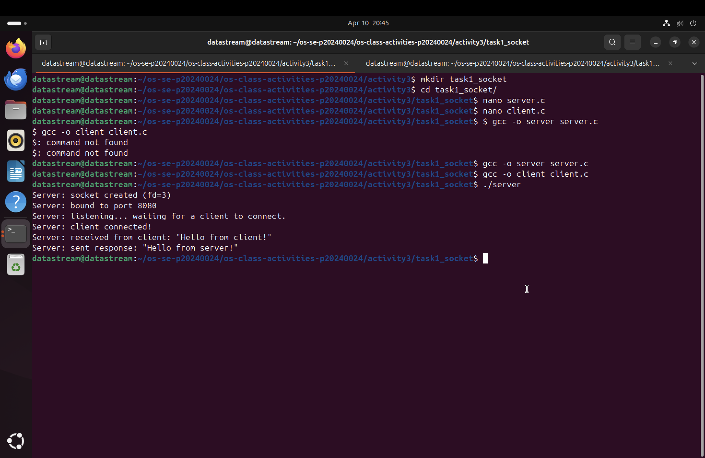
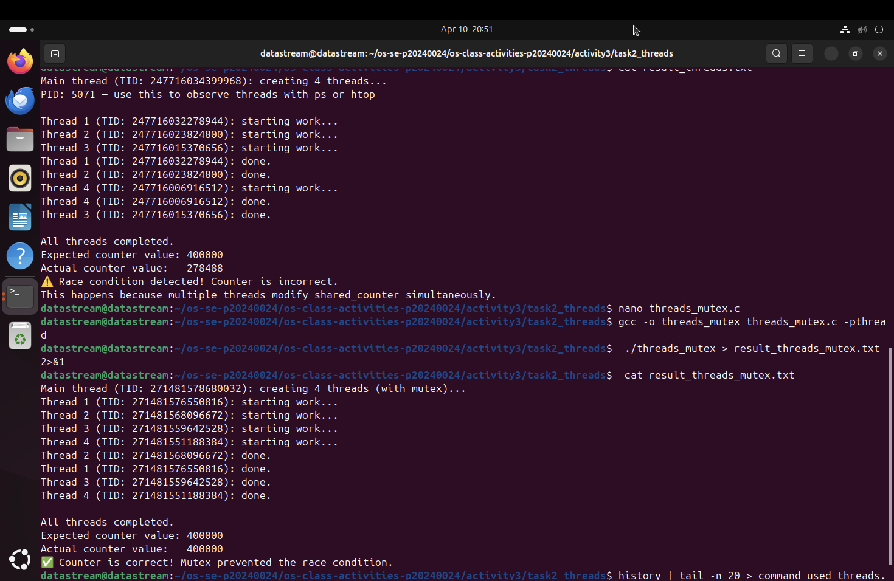
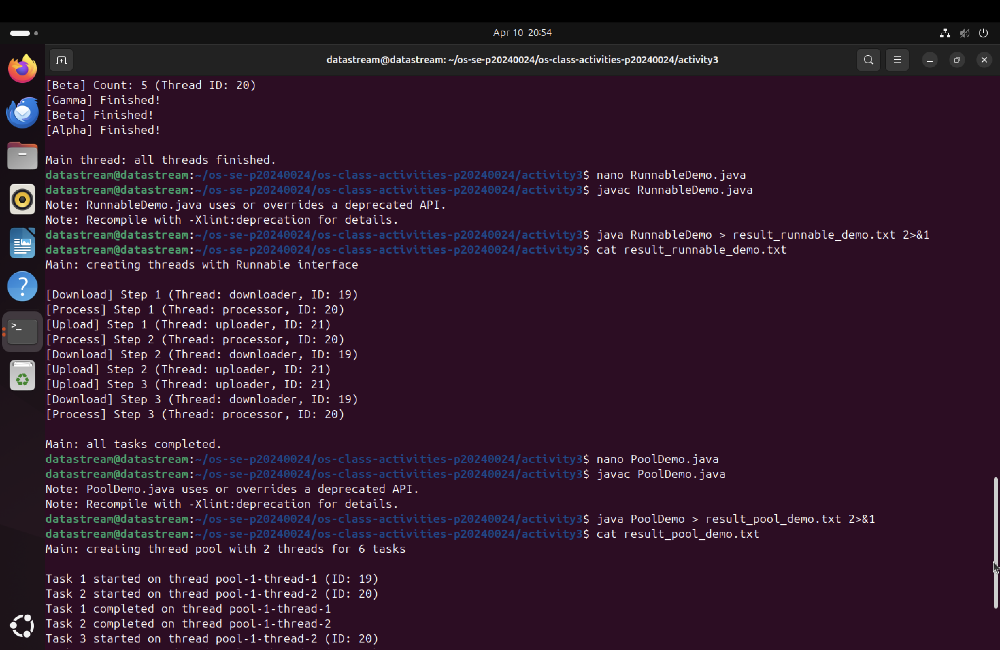

# Class Activity 3 — Socket Communication & Multithreading

- **Student Name:** Chin Menghong
- **Student ID:** p20240024
- **Date:** April 11, 2026

---

## Task 1: TCP Socket Communication (C)

### Compilation & Execution



### Answers

1. **Role of `bind()` / Why client doesn't call it:**
   > `bind()` tells the OS to assign a specific port number to the server's socket so clients know where to send data. The client doesn't call it because it doesn't care which local port it uses; the OS automatically assigns a temporary "ephemeral" port when it calls `connect()`.

2. **What `accept()` returns:**
   > It returns a **new file descriptor** representing the specific connection to that client. This allows the original listening socket to remain free to wait for other new connections while the server communicates with the first client on the new socket.

3. **Starting client before server:**
   > The client will fail immediately with a "Connection Refused" error. Since the server hasn't called `listen()`, there is no active process on the port to complete the TCP handshake.

4. **What `htons()` does:**
   > It stands for "Host to Network Short." It converts the port number from the host's byte order (Little-Endian on my Apple M2) to Network Byte Order (Big-Endian). This is crucial so that different types of computers can agree on what the port number is.

5. **Socket call sequence diagram:**
   > **Server:** `socket()` -> `bind()` -> `listen()` -> `accept()` -> `read/write()` -> `close()`
   > **Client:** `socket()` -> `connect()` -> `write/read()` -> `close()`

---

## Task 2: POSIX Threads (C)

### Output — Without Mutex (Race Condition)



### Answers

1. **What is a race condition?**
   > A race condition occurs when multiple threads try to modify the same variable at the same time. Because the CPU might switch threads in the middle of a "read-modify-write" operation, some increments get "lost," resulting in an incorrect final count.

2. **What does `pthread_mutex_lock()` do?**
   > It acts as a "gatekeeper." If a thread hits a lock that is already held by another thread, it must wait (block) until the owner unlocks it. This ensures only one thread can modify the shared counter at a time.

3. **Removing `pthread_join()`:**
   > The `main()` function would finish and exit before the threads are done. Since threads belong to the process, when `main` exits, the OS kills the entire process—terminating all worker threads instantly before they can finish their count.

4. **Thread vs Process:**
   > A process has its own isolated memory space. A thread is a "unit of execution" *inside* a process; multiple threads share the same memory and variables, which makes them faster to create but requires tools like mutexes to prevent data corruption.

---

## Task 3: Java Multithreading

### ThreadDemo Output



### Answers

1. **Thread vs Runnable:**
   > Implementing `Runnable` is generally better because Java only allows a class to inherit from one parent. By using `Runnable`, your class can still inherit from another class while being able to run as a thread.

2. **Pool size limiting concurrency:**
   > In a `FixedThreadPool(2)`, only two threads can run at once. If you submit 10 tasks, 2 will run immediately and the other 8 will wait in a queue until a thread becomes free.

3. **thread.join() in Java:**
   > It makes the calling thread (usually the `main` thread) wait until the specific thread object finishes its execution.

4. **ExecutorService advantages:**
   > It manages a "pool" of threads so the OS doesn't have to constantly create and destroy them, which saves significant CPU overhead. It also handles task queuing automatically.

---

## Task 4: Observing Threads

### Linux — `ps -eLf` Output
```text
UID          PID    PPID     LWP  C NLWP STIME TTY          TIME CMD
datastr+    5414    2681    5414  0    5 21:05 pts/0    00:00:00 ./threads_observe
datastr+    5414    2681    5415  0    5 21:05 pts/0    00:00:00 ./threads_observe
datastr+    5414    2681    5416  0    5 21:05 pts/0    00:00:00 ./threads_observe
datastr+    5414    2681    5417  0    5 21:05 pts/0    00:00:00 ./threads_observe
datastr+    5414    2681    5418  0    5 21:05 pts/0    00:00:00 ./threads_observe

## Reflection

> **What did you find most interesting about socket communication and threading?**
> The most interesting part was seeing how the OS handles the "hand-off" between different layers. With sockets, seeing that my M2 Mac (Little-Endian) needs `htons()` to talk to a network (Big-Endian) made me realize how much the OS abstracts away hardware differences. For threading, using `strace` to see the explosion of system calls in a library-based program versus the lean execution of a syscall-based one was a "lightbulb moment" for understanding software overhead.

> **How does understanding threads at the OS level help you write better concurrent programs?**
> It changes how I think about variable safety. Now that I’ve seen threads listed as individual LWPs (Lightweight Processes) in `/proc`, I understand that the kernel treats them as independent units that can be paused at any time. This makes it clear why a "race condition" happens: if the kernel pauses a thread in the middle of an increment, another thread can step in and overwrite the data. Understanding this mechanical reality makes using mutexes feel like a necessity rather than just a coding rule.