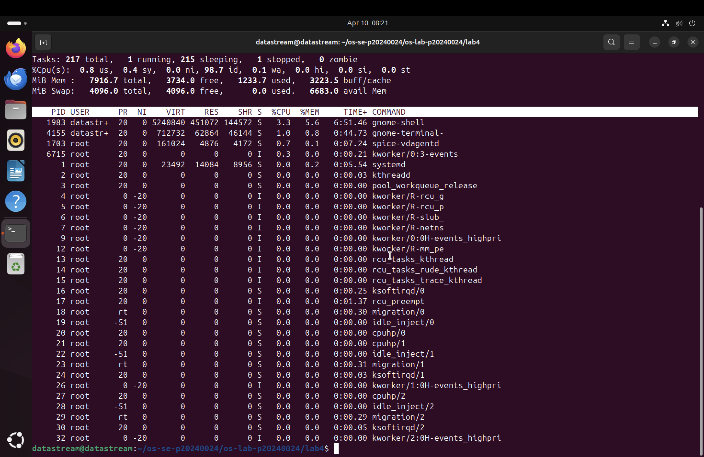
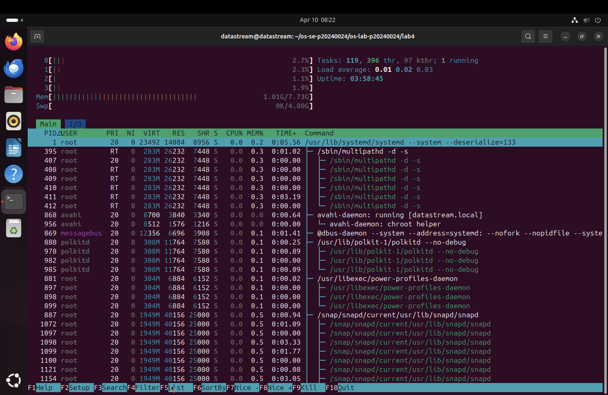
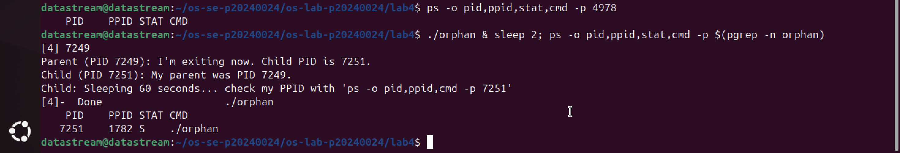
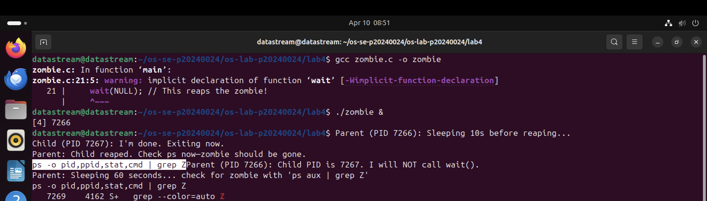
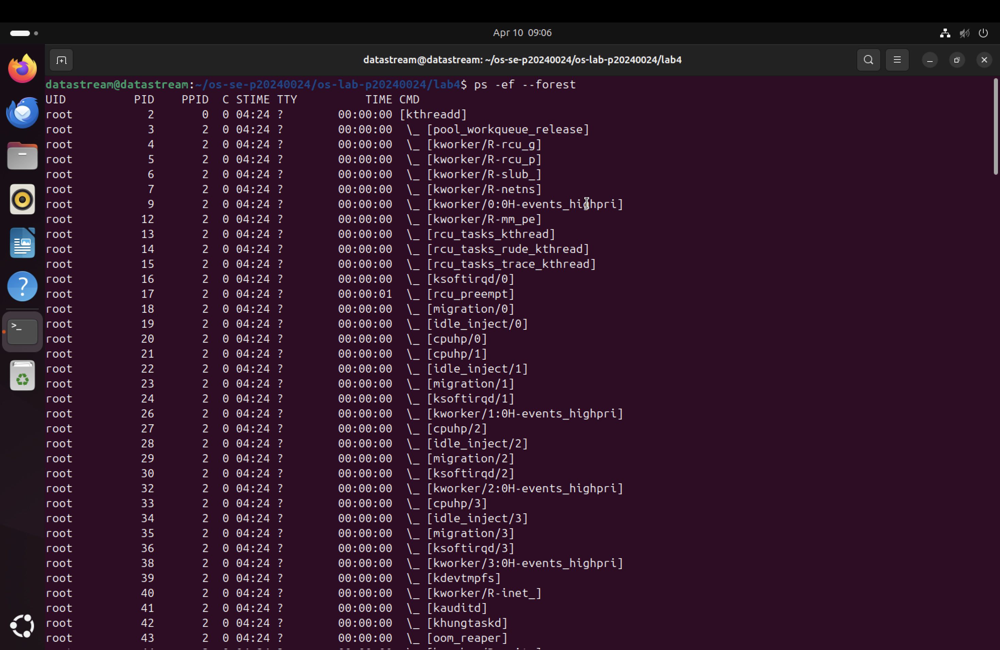

# Lab 4 — I/O Redirection, Pipelines & Process Management

| | |
|---|---|
| **Student Name** | Chin Menghong |
| **Student ID** | p20240024 |

---

## 📋 Task Completion Status

| Task | Output File | Status |
|:---|:---|:---|
| **Task 1: I/O Redirection** | `task1_redirection.txt` | ☑ Complete |
| **Task 2: Pipelines & Filters** | `task2_pipelines.txt` | ☑ Complete |
| **Task 3: Data Analysis** | `task3_analysis.txt` | ☑ Complete |
| **Task 4: Process Management** | `task4_processes.txt` | ☑ Complete |
| **Task 5: Orphan & Zombie** | `task5_orphan_zombie.txt` | ☑ Complete |

---

## 📸 Evidence of Work (Screenshots)

### Task 4 — `top` Process List

*Displays active processes, CPU usage, and memory distribution.*

### Task 4 — `htop` Tree View

*Shows the parent-child hierarchy of active system processes.*

### Task 5 — Orphan Process Adoption

*Proof of the child's PPID changing to 1782 (systemd --user) after the parent's exit.*

### Task 5 — Zombie Process State

*Shows the process in the `Z` (defunct) state before being reaped.*

### Challenge — Process Forest

*Visualizing three child processes branching from a single parent.*

---

## 🧠 Critical Analysis: Task 5 Questions

**1. How are orphans cleaned up?**
> Orphans are adopted by a "reaper" process. In modern Ubuntu environments, this is typically the `systemd --user` instance (PID 1782) or the global `systemd` (PID 1). This guardian process takes over responsibility for the child and performs the final cleanup when it finishes.

**2. How are zombies cleaned up?**
> Zombies are removed from the process table only when their parent process acknowledges them by calling the `wait()` or `waitpid()` system call. If a parent is unresponsive, the zombie is reaped only after its parent dies and the child is adopted by `systemd`.

**3. Can you kill a zombie with `kill -9`? Why or why not?**
> No. A zombie process is already dead; it has no memory, code, or execution state to terminate. It is merely a remaining entry in the system's process table. You can only remove it by having the parent "wait" on it or by killing the parent process.

---

## 📝 Reflection

The most valuable technique I learned was the power of **Pipelines combined with `uniq -c`**. In a production environment, being able to pipe `grep` results into `sort` and `uniq` allows for near-instant log analysis, such as identifying a DDoS attack by counting unique IP hits in real-time. Additionally, understanding **Process Lifecycle** is crucial for debugging why an application might be leaking system resources despite the "main" process appearing to be closed.